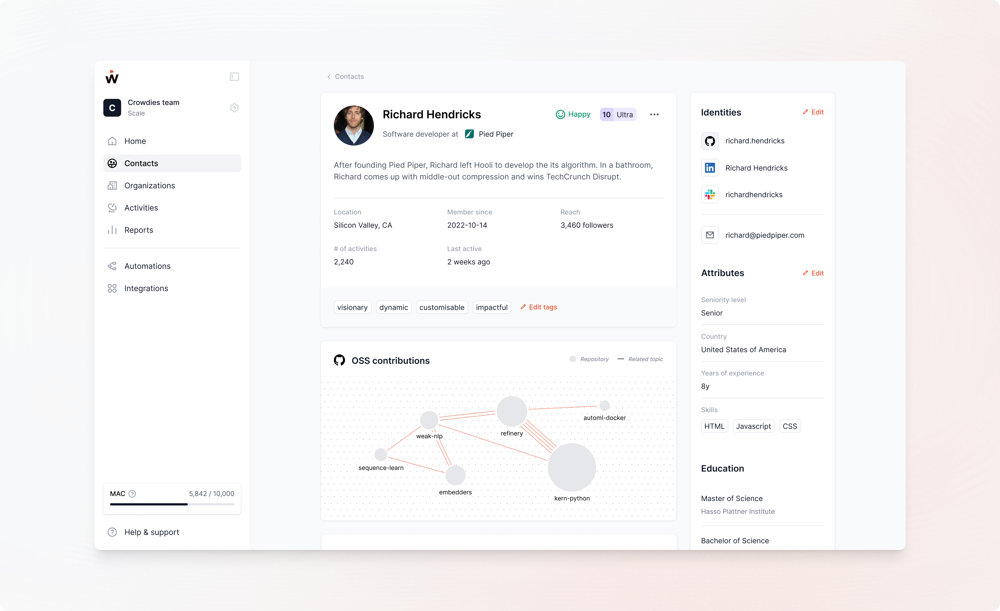
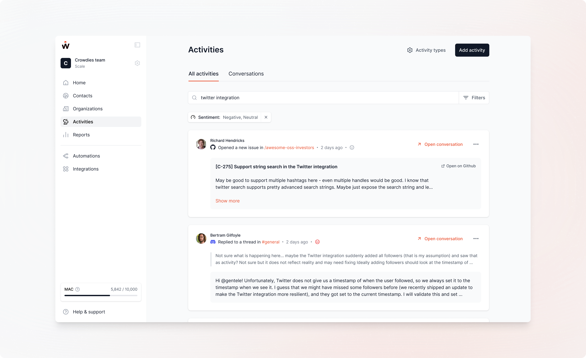

# 🗺 Explore popular use cases

crowd.dev helps you identify and act on signals in your developer data. Combine data from GitHub, LinkedIn, your product, and many other sources to understand which developers and companies engage with your product and brand. You can sync these insights with your CRM to prioritize and nurture the right accounts and build pipeline.

To get started with crowd.dev, try a few of our most popular use cases:

* [Spot & contact influential contacts ](explore-popular-use-cases.md#spot-and-contact-influential-members)
* [Re-engage slipping away contacts](explore-popular-use-cases.md#re-engage-slipping-away-members)
* [Identify sales opportunities](explore-popular-use-cases.md#identify-sales-opportunities)
* [Conduct product research](explore-popular-use-cases.md#conduct-product-research)
* [Get notified about key community activities](explore-popular-use-cases.md#get-notified-about-key-community-activities)
* [Find relevant content to engage with](explore-popular-use-cases.md#find-relevant-content-to-engage-with)
* [Manage your daily community to-do’s](explore-popular-use-cases.md#manage-your-daily-community-to-dos)
* [Measure community impact](explore-popular-use-cases.md#measure-community-impact)

***

### Spot & contact influential contacts

To spot and contact influential contacts in your developer community, navigate to the Contacts page and click on the[ Influential view](https://app.crowd.dev/contacts?search=\&relation=and\&order.prop=lastActive\&order.order=descending\&settings.bot=exclude\&settings.teamMember=exclude\&settings.organization=exclude\&reach.operator=gte\&reach.value=500). This will show you all contacts that have more than 500 followers (called “Reach”) on their social profiles combined across the platforms you connected (e.g., GitHub). By default, they are sorted by Reach, but you could also go on and apply filters to e.g., only see influential contacts that joined in the last 30 days or only those that have a high engagement level.&#x20;

Once you have identified contacts with high reach, you can try engaging them with a message. To do so, click on one of their identities (e.g., Twitter or Email) and draft a private message. We recommend keeping it short and sweet to increase the likelihood of a response.

Here is an example:

_Hey (name of contact),_

_I am (your name), the (your role) of (community name). We’ve noticed you are one of our most involved community members, so we wanted to thank you for your contributions to our community. We really appreciate it! Is there anything I can do to help you?_

### Re-engage slipping away community contacts

To re-engage contacts that are slipping away and engaging less with your product, navigate to the Contacts page and click on the[ Slipping away view.](https://app.crowd.dev/contacts?search=\&relation=and\&order.prop=lastActive\&order.order=descending\&settings.bot=exclude\&settings.teamMember=exclude\&settings.organization=exclude\&engagementLevel.value=fan,ultra\&engagementLevel.include=true\&lastActivityDate.operator=lt\&lastActivityDate.value=2023-09-07) This will show you all contacts that have a high engagement level (between 7-10) but did not do any activities in your community in the last 14 days. We recommend re-engaging those contacts, for example, by sending them an email or a Discord message.

### Identify sales opportunities

Identifying sales opportunities in your contacts allows you to engage directly with your potential customers and gather valuable insights and feedback. While we don't recommend that you conduct regular sales motions in your community, it can be a good starting point for a conversation.

The best place to identify sales opportunities in crowd.dev is in the [Organizations module](https://app.crowd.dev/organizations). Here, you can discover all the organizations that your contacts are associated with.

To spot very active organizations, you can, for example, use the [Most contacts view](https://app.crowd.dev/organizations?search=\&relation=and\&order.prop=memberCount\&order.order=descending\&settings.teamOrganization=exclude), which sorts all organizations by the number of contacts they have in your community. Each organization has a dedicated profile view where you can take a look at all the data we collected.&#x20;

<figure><figcaption></figcaption></figure>

### Conduct product research

Your community is a great place to do product discovery and learn what people have to say, for example, about certain problems or features you are providing. crowd.dev is collecting all your contacts’ feedback across all platforms and making them easily searchable for you. To conduct product research, navigate to the [Activities module](https://app.crowd.dev/activities) and type in a keyword. You can then refine the search results by applying different filters (e.g., sentiment or platform). Here is an example where I looked for activities regarding our “twitter integration” with a negative or neutral sentiment:&#x20;

<figure><figcaption></figcaption></figure>

### Get notified about key community activities

To get notified about key activities in your community, navigate to the [Automations tab](https://app.crowd.dev/settings?activeTab=automations) in the settings. Here, you can create webhooks for every activity that happens in your community. Follow the following steps:

1. Click “Add webhook”.
2. Choose the trigger “New activity happened in your community”
3. Refine the activities that trigger the webhook by applying filters for platform, activity type, or keywords.
4. Define a Webhook URL where the webhook should be sent, e.g., from an automation tool like [Make](https://make.com/).
5. Go to Make and create a workflow with a webhook as a trigger point. You can now use the webhook payload to send a notification to Slack or an email to your team.

If you need help with setting up webhooks, send an email to [help@crowd.dev](mailto:help@crowd.dev).

### Find relevant content to engage with

Our Eagle Eye app (in our Scale plan) allows you to monitor different community platforms to find relevant content to engage with, ultimately helping you to gain developers’ mindshare and grow your community.

Navigate to the [Eagle Eye app](https://app.crowd.dev/eagle-eye), type in a few keywords that are relevant to your niche, open the post by clicking on it, and leave a thoughtful comment. After that, you can mark the post as “engaged” to keep track of the posts that you engaged with through Eagle Eye.&#x20;

### Manage your daily community to-do’s

To manage your daily community to-do’s you can leverage the [Tasks module](https://app.crowd.dev/task). Here you can create and manage tasks, relate them to contacts of your community, and assign them to you or your colleagues. Typical tasks we use are, for example, “reach out to this contact regarding ambassador program” or “follow up with contact regarding support request on Discord”.

You can also create tasks in a contact's profile view. You only need to switch to the “Tasks” tab and click “Add task”. This will open the same window for task creation.

Learn more about Tasks [here](https://docs.crowd.dev/docs/tasks).

### Measure community impact

Measuring impact is important to prove the business value of your community. Our [reporting module](https://app.crowd.dev/reports) helps you to easily tie different metrics together and share them with your colleagues.

By default, you can find an example report in your workspace. Duplicate and modify it to tailor the report to your specific needs. If you want to share a report, publish it and copy and paste the public URL.

Learn more about Reports [here](../guides/reports/).


Thanks for reading through this. We’d love to hear about your personal use cases for crowd.dev. Please feel free to reach out to use via [hello@crowd.dev](mailto:hello@crowd.dev) or drop a message in our [Discord community](http://crowd.dev/discord).


