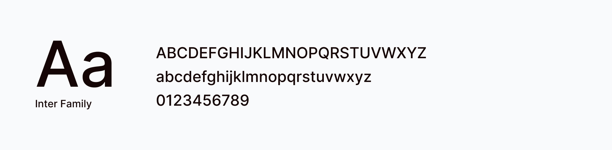

# 🎨 Brand

## Logos

<table data-view="cards"><thead><tr><th></th><th></th><th data-hidden></th><th data-hidden data-card-cover data-type="files"></th></tr></thead><tbody><tr><td>Primary logo</td><td><a href="https://drive.google.com/drive/folders/1PjPoLh2viLgxA1gvCi7oXUziO7-ld-pU?usp=drive_link">Download</a></td><td></td><td><a href="../.gitbook/assets/logo1.png">logo1.png</a></td></tr><tr><td>Monotone logo - Dark</td><td><a href="https://drive.google.com/drive/folders/18ixNY30N4MqPBTFHKQmERXXcLjY4U3KI?usp=drive_link">Download</a></td><td></td><td><a href="../.gitbook/assets/logo2.png">logo2.png</a></td></tr><tr><td>Monotone logo - White</td><td><a href="https://drive.google.com/drive/folders/167NBW_je_PgeG3dkTvdX_ReJfBozHekL?usp=drive_link">Download</a></td><td></td><td><a href="../.gitbook/assets/logo3.png">logo3.png</a></td></tr></tbody></table>

<table data-view="cards"><thead><tr><th></th><th></th><th data-hidden></th><th data-hidden data-card-cover data-type="files"></th></tr></thead><tbody><tr><td>Primary symbol</td><td><a href="https://drive.google.com/drive/folders/1lOWHVHPWaLr43lpkq_9Pg5a7sJI1BPOO?usp=drive_link">Download</a></td><td></td><td><a href="../.gitbook/assets/symbol1.png">symbol1.png</a></td></tr><tr><td>Monotone symbol - Dark</td><td><a href="https://drive.google.com/drive/folders/1-Ul_LtJEq3jFsnsx5XuBJrZCbpG91S4A?usp=sharing">Download</a></td><td></td><td><a href="../.gitbook/assets/symbol2.png">symbol2.png</a></td></tr><tr><td>Monotone symbol - White</td><td><a href="https://drive.google.com/drive/folders/1coMK8zStCpn3IJytFmA04eP-X3jJY3aF?usp=drive_link">Download</a></td><td></td><td><a href="../.gitbook/assets/symbol3.png">symbol3.png</a></td></tr></tbody></table>

[Download](https://drive.google.com/drive/folders/15g9DJZXW2Vunkj-zjsTGXvLTZHuydUju?usp=sharing) logos & symbols full package

## Color

#### Main colors

<table data-view="cards"><thead><tr><th></th><th></th><th data-hidden data-card-cover data-type="files"></th></tr></thead><tbody><tr><td><strong>Brand color</strong></td><td>#E94F2E</td><td><a href="../.gitbook/assets/brand-500.png">brand-500.png</a></td></tr><tr><td><strong>Dark gray</strong></td><td>111827</td><td><a href="../.gitbook/assets/gray-900.png">gray-900.png</a></td></tr><tr><td><strong>Light gray</strong></td><td>F9FAFB</td><td><a href="../.gitbook/assets/gray-50.png">gray-50.png</a></td></tr></tbody></table>

#### Tints & Shades

<table data-header-hidden><thead><tr><th width="100"></th><th></th><th align="right"></th></tr></thead><tbody><tr><td></td><td>Brand-50</td><td align="right">#FDEDEA</td></tr><tr><td></td><td>Brand-100</td><td align="right">#FBDCD5</td></tr><tr><td></td><td>Brand-200</td><td align="right">#F6B9AB</td></tr><tr><td></td><td>Brand-300</td><td align="right">#F29582</td></tr><tr><td></td><td>Brand-400</td><td align="right">#ED7258</td></tr><tr><td></td><td>Brand-500 <em>(primary)</em></td><td align="right">#E94F2E</td></tr><tr><td></td><td>Brand-600</td><td align="right">#BA3F25</td></tr><tr><td></td><td>Brand-700</td><td align="right">#8C2F1C</td></tr><tr><td></td><td>Brand-800</td><td align="right">#5D2012</td></tr><tr><td></td><td>Brand-900</td><td align="right">#2F1009</td></tr></tbody></table>

<table data-header-hidden><thead><tr><th width="100"></th><th></th><th align="right"></th></tr></thead><tbody><tr><td></td><td>Gray-50</td><td align="right">#F9FAFB</td></tr><tr><td></td><td>Gray-100</td><td align="right">#F3F4F6</td></tr><tr><td></td><td>Gray-200</td><td align="right">#E5E7EB</td></tr><tr><td></td><td>Gray-300</td><td align="right">#D1D5DB</td></tr><tr><td></td><td>Gray-400</td><td align="right">#9CA3AF</td></tr><tr><td></td><td>Gray-500</td><td align="right">#6B7280</td></tr><tr><td></td><td>Gray-600</td><td align="right">#4B5563</td></tr><tr><td></td><td>Gray-700</td><td align="right">#374151</td></tr><tr><td></td><td>Gray-800</td><td align="right">#1F2937</td></tr><tr><td></td><td>Gray-900</td><td align="right">#111827</td></tr></tbody></table>

## Typography

<figure><figcaption></figcaption></figure>

Download Inter font family:


