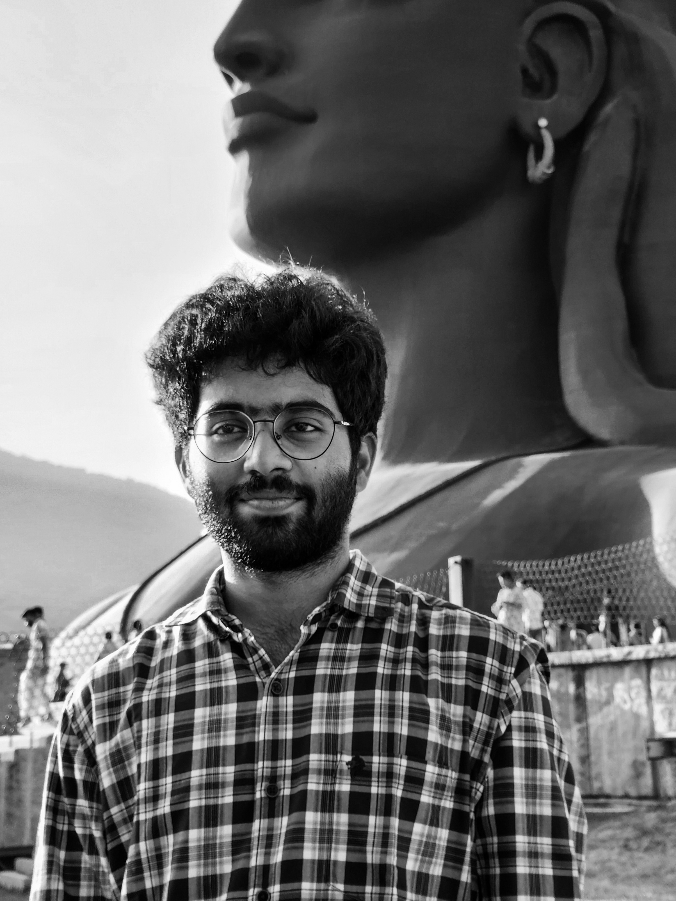

# 🧑🤝🧑 Team

All team members _sorted by the date they joined crowd.dev._

### Jonathan Reimer (CEO) 🇩🇪

Jonathan was born and raised in Germany with 5 siblings. After his dream of becoming a basketball player burst, he studied economics & computer science in Bonn, where he also had his first touch points with developers' tools and the world of open-source. After being Head of Business Development at Code Intelligence, he went on and advised several open-source and developer-focussed companies before starting crowd.dev together with Joan. Besides running the company, Jonathan is doing a lot of sports, listening to (and playing) electronic & hip-hop music, and traveling.

### Joan Reyero (CTO) 🇪🇸

### Anil Bostanci (Software Engineer) 🇹🇷

### Uroš Marolt (Software Engineer) 🇸🇮

### Nuno Eufrásio (Product Designer) 🇵🇹

Nuno was born and grew up in Coimbra, a small city in Portugal known for holding one of the oldest universities in the world. Passionate about maps, data visualization, and magazine illustrations since he remembers, always knew his journey would fall into some sort of creative field. After getting his degree in Communication and Multimedia Design, and spending some time playing the graphic design role, he slowly started moving into the UX field, where he feels most comfortable. During the last 8 years, he’s been helping businesses craft digital user experiences and ease people’s lives, focusing his work around usability, accessibility, and aesthetics. Currently, is taking the lead in [crowd.dev](http://crowd.dev/)’s product design and building bridges between its customers and the development team. When not at work, you won’t find Nuno getting tanned and riding waves at some Portuguese beach or surf sanctuary, as he rather prefers the peacefulness of the mountains and the adrenaline of ski slopes.

<figure><figcaption></figcaption></figure>

### Charlotte Schmitt (Chief of Staff) 🇩🇪

Charlotte is from Germany, but after only 8 short months, her family moved abroad, and she lived in Moscow for 16 years. She then moved to Frankfurt for her Bachelor's in Economics and Business and worked in Marketing at larger corporates. After realizing that was not for her, she completed a Master of Management at ESCP in Berlin and Paris with a focus on entrepreneurship and worked at a MedTech Startup. Then, as you do coming out of business school, she spent two years in consulting before starting her own company SaveSpace. Now at crowd.dev, beyond her CoS duties, she is known for trying to get everyone on the social calls, encouraging people to work out with her on offsites, and referencing the latest Tim Ferriss or Huberman podcast.&#x20;

<figure><figcaption></figcaption></figure>

### Joana Maia (Software Engineer) 🇵🇹

### Igor Kotua (Software Engineer) 🇷🇺

### Gašper Grom (Software Engineer) 🇸🇮

### Misha Savelyev (Software Engineer) 🇷🇺

### Yeganathan Selva Kumar (Software Engineering Intern) 🇮🇳

Yeganathan (people often call him Nathan) was born and brought up in India, and is a senior computer science and engineering student and full-stack developer. Always tech-obsessed, his coding journey began during high school. He’s a startup guy, having interned at two early-stage companies across varied domains. A fanatical open-sourcer, Nathan spends his weekends building [gitwonk.com](http://gitwonk.com/) on the other side of the web. Formerly an external contributor, he joined the team at [crowd.dev](http://crowd.dev/), making his mark as their first-ever intern. When the monitors switch off, and the debugging ceases, you can find him unwinding with music, binge-watching, playing chess, or enjoying time with his canine companions (an ardent dog lover).

<figure><figcaption></figcaption></figure>

### Jesse Singer (Customer Success) 🇿🇦

Jesse is from Cape Town, South Africa. He specialized in finance at The University of Cape Town, before working with UK private equity, venture capital and advisory firms. His desire to have an impact led to him launching two technology startups in South Africa. Following that he was Head of Growth at an ecommerce company. Now he’s championing Customer Success at [crowd.dev](http://crowd.dev/). Advocating for users and working with teams to drive genuine impact. When he’s not at his desk you can find him eating sushi, playing waterpolo or brewing some specialty coffee.

<figure><figcaption></figcaption></figure>

